# ZS-VCOS: Zero-Shot Outperforms Supervised Video Camouflaged Object Segmentation with Zero-Shot Method

## Leaderboard
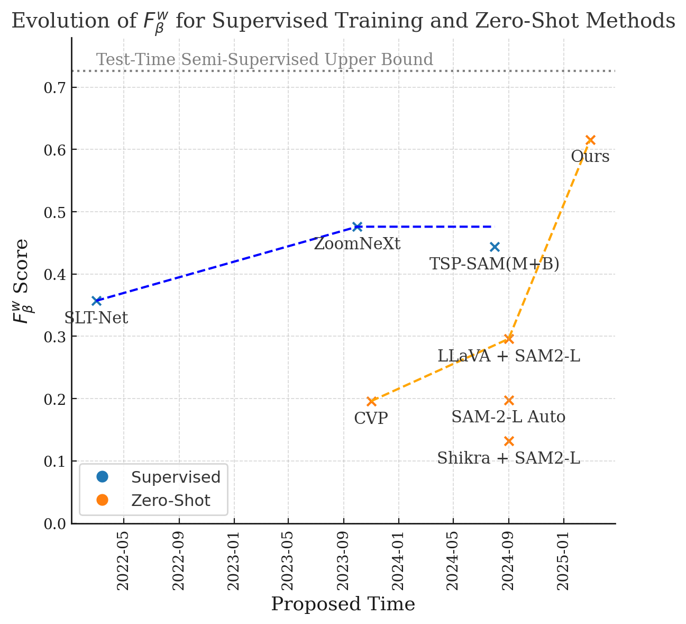

## Method Overview

## Performance comparison on the MoCA-Mask dataset

"SV Tr" denotes supervised training, and "SV Te" denotes supervised testing, where one frame from the video was provided to the model along with prompts. "ZS" indicates zero-shot learning, while ZS w/ PK means zero-shot with prior knowledge (since the model already knows it is looking for animals). Our method significantly outperforms all zero-shot and even supervised methods.

| Method                               | Pub.      | Setting      | $S_{\alpha}$ | $F_{\beta}^{w}$ | MAE   |
|-------------------------------------|-----------|--------------|--------------|-----------------|--------|
| SLT-Net                              | CVPR 22   | SV Tr        | 0.656        | 0.357           | 0.021 |
| ZoomNeXt                             | TPAMI 24  | SV Tr        | **0.734**    | **0.476**       | 0.010 |
| TSP-SAM(M+B)                         | CVPR 24   | SV Tr        | 0.689        | 0.444           | **0.008** |
| Gao *et al.*                         | arXiv 25  | SV Tr        | 0.709        | 0.451           | 0.008 |
|-------------------------------------|-----------|--------------|--------------|-----------------|--------|
| SAM2 Tracking                        | arXiv 24  | SV Te*       | 0.804        | 0.691           | 0.004 |
|-------------------------------------|-----------|--------------|--------------|-----------------|--------|
| SAM-PM                               | CVPRW 24  | SV Tr+Te*    | 0.728        | 0.567           | 0.009 |
| Finetuned SAM2-T + Prompts          | arXiv 24  | SV Tr+Te*    | **0.832**    | **0.726**       | **0.005** |
|-------------------------------------|-----------|--------------|--------------|-----------------|--------|
| CVP                                  | ACM MM 24 | ZS           | 0.569        | 0.196           | 0.031 |
| SAM-2-L Auto                         | arXiv 24  | ZS           | 0.447        | 0.198           | 0.250 |
| LLaVA + SAM2-L                       | arXiv 24  | ZS w/ PK     | 0.622        | 0.296           | 0.047 |
| Shikra + SAM2-L                      | arXiv 24  | ZS w/ PK     | 0.495        | 0.132           | 0.107 |
| Ours                                 | -         | ZS w/ PK     | **0.776**    | **0.628**       | **0.008** |

## Testing Visualizations

### Arctic Fox – mIoU: 0.842  
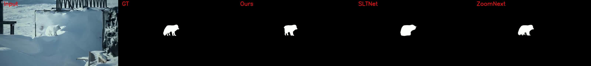

### Arctic Fox 3 – mIoU: 0.787  
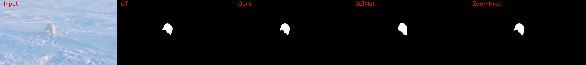

### Black Cat 1 – mIoU: 0.479  

### Copperhead Snake – mIoU: 0.575  

### Flower Crab Spider 0 – mIoU: 0.761  
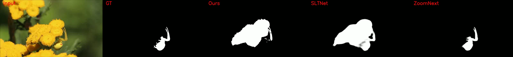

### Flower Crab Spider 1 – mIoU: 0.783  
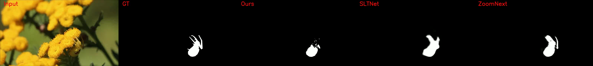

### Flower Crab Spider 2 – mIoU: 0.758  
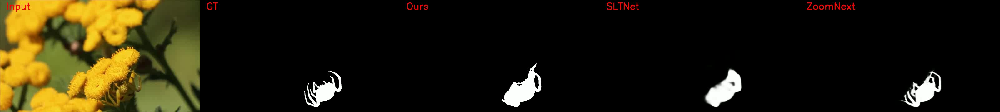

### Hedgehog 3 – mIoU: 0.502  
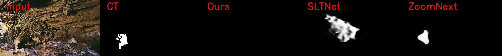

### Ibex – mIoU: 0.615  
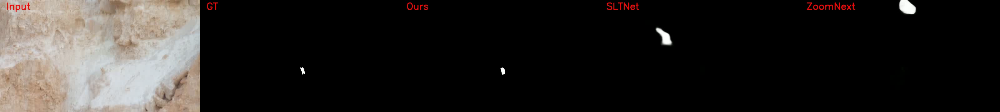

### Mongoose – mIoU: 0.388  
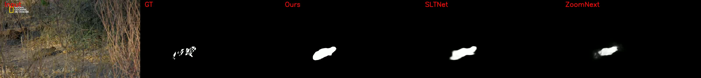

### Moth – mIoU: 0.774  
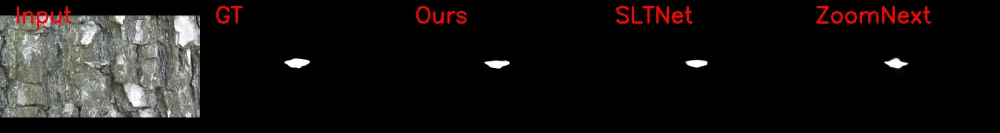

### Pygmy Seahorse 0 – mIoU: 0.000  
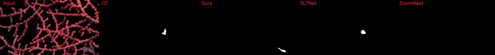

### Rusty Spotted Cat 0 – mIoU: 0.217  
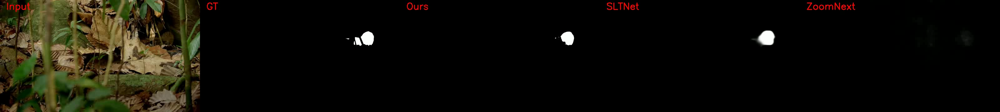

### Sand Cat 0 – mIoU: 0.613  
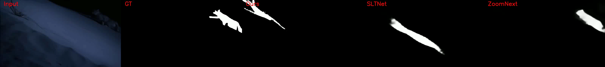

### Snow Leopard 10 – mIoU: 0.468  

### Stick Insect 1 – mIoU: 0.246  

